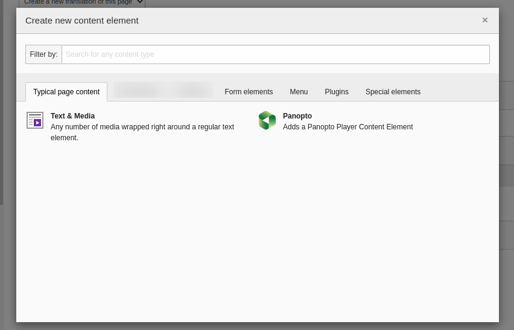
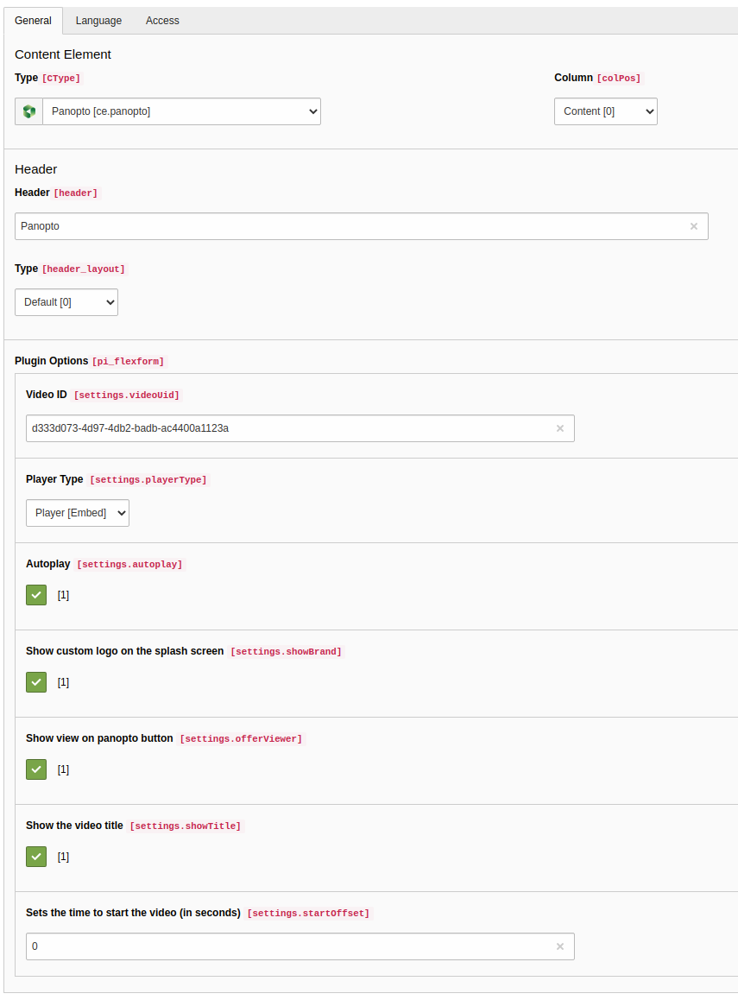
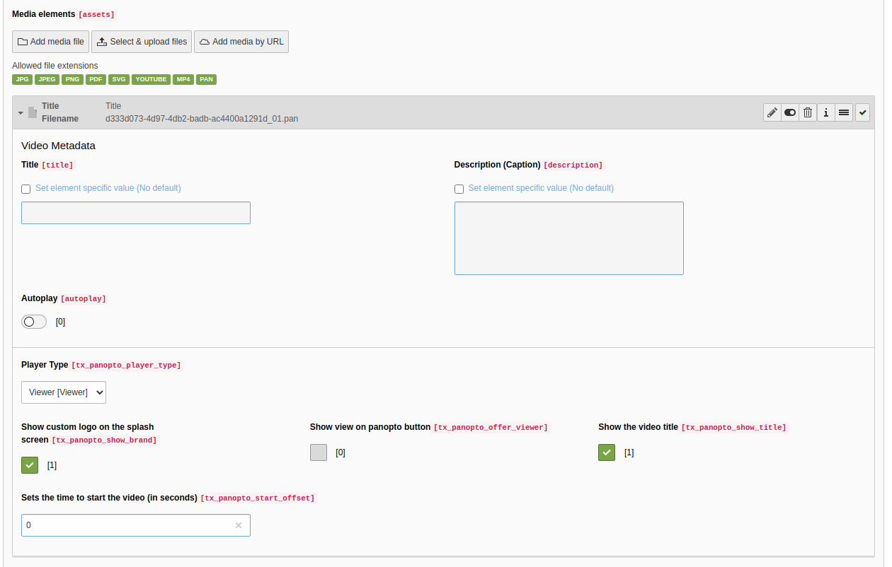

# TYPO3 Extension `panopto`

Provides a content element and the ability to add videos of the end-to-end-video-content-management-system panopto via "Add media by URL" in Text & Media elements.

## Usage

Install the extension and add the template include "Panopto".

## Content Element Options

You find a detailed description of each option for the panopto player here:
https://support.panopto.com/s/article/Embed-a-Video

## Configuration

the cType for this extension is `ce.panopto`

#### Panopto id for testvideo: `2b69a50b-6733-4422-bd5a-af6a0183fea7`

#### Panopto domain / path

there are typoscript constants for the panopto domain and path which can be easily overwritten.

```typo3_typoscript
plugin.tx_panopto {
    settings {
        domain = https://demo.hosted.panopto.eu/
        path = Panopto/Pages/
    }
}
```

#### Template

you can also add your own template path if you

```typo3_typoscript
tt_content.ce\.panopto {
  templateRootPaths {
    30 = EXT:yourExtension/Resources/Private/Templates/
  }
}
```

## Requirements

* TYPO3 10.4 or newer
* PHP 7.2 or newer

## Screenshots


Fig. 1) Create Content Element wizard



Fig. 2) Panopto Content Element


Fig. 3) Panopto File Reference in a Text Media Content Element
